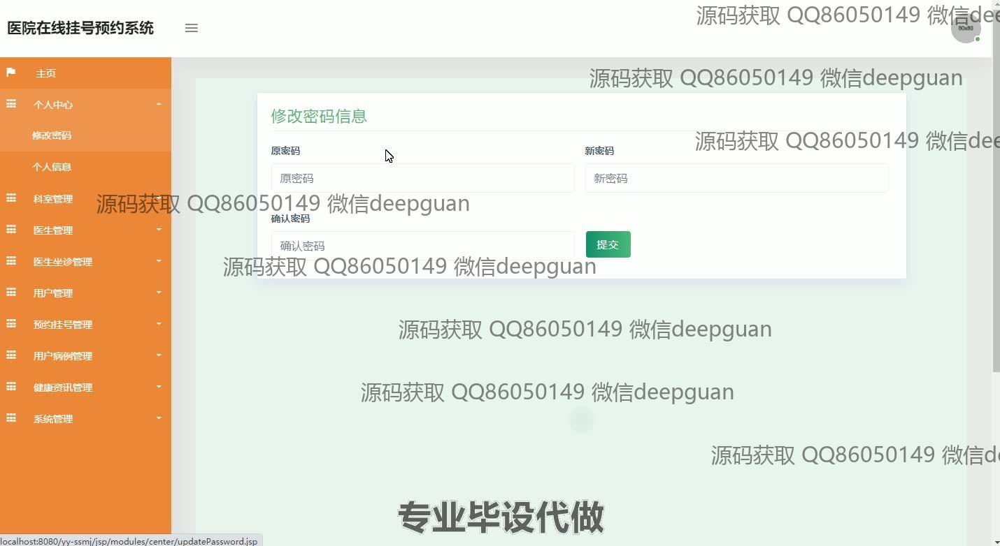
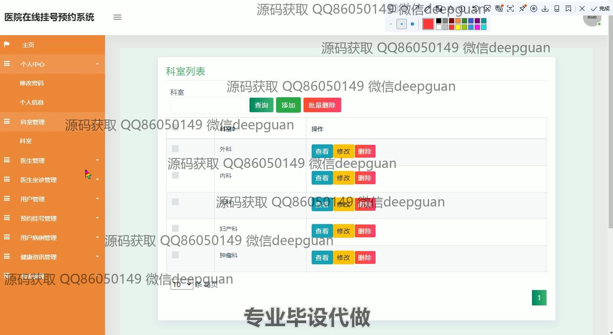
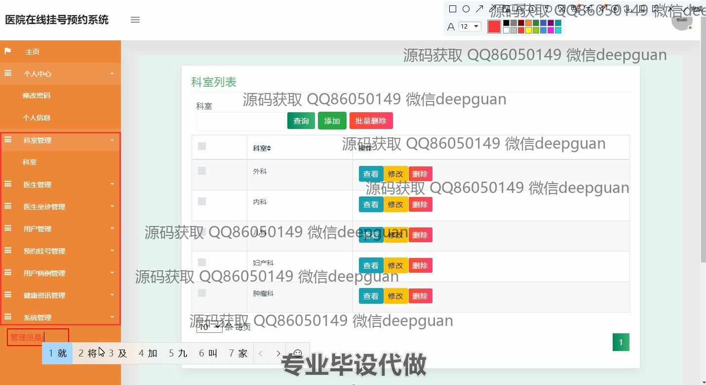
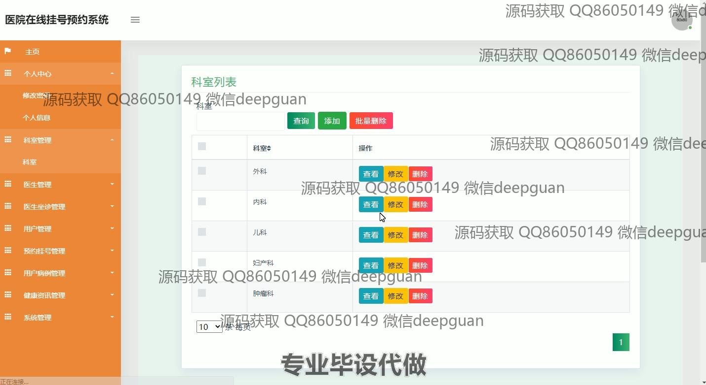
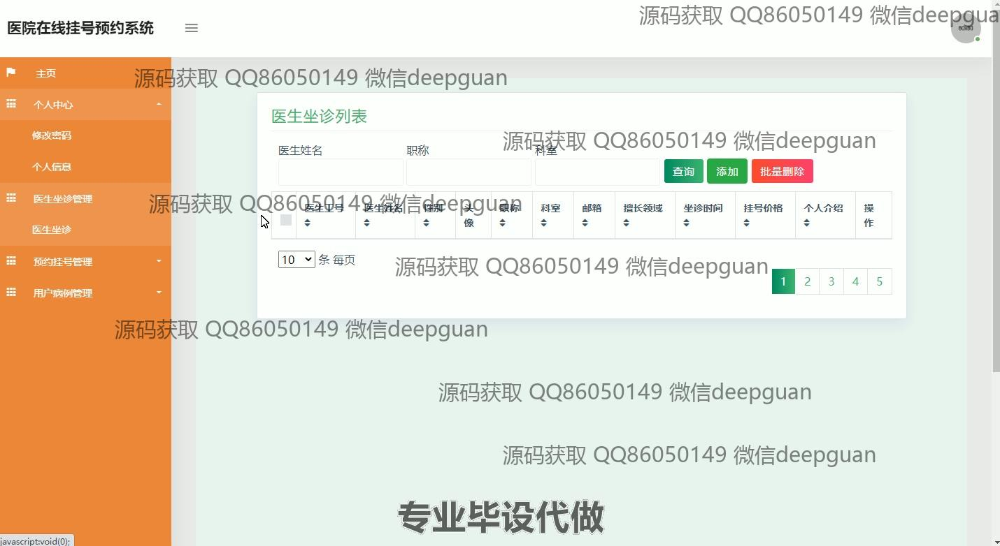
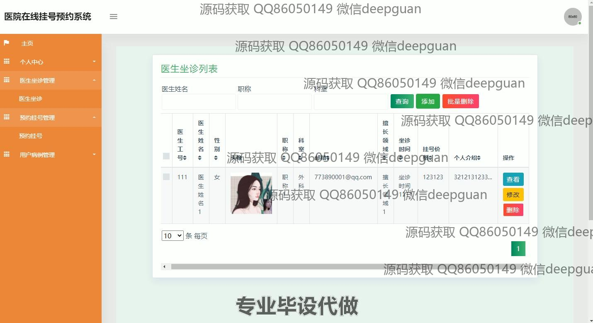
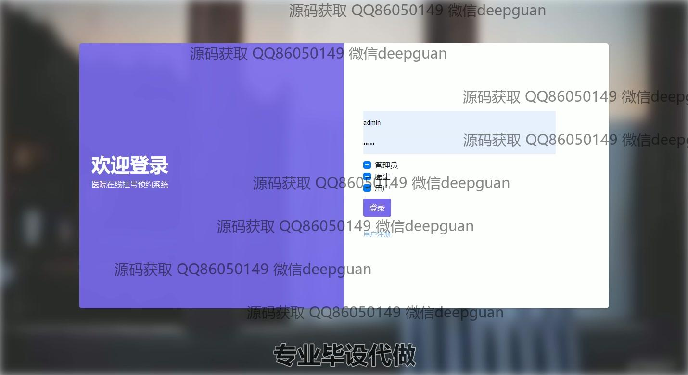
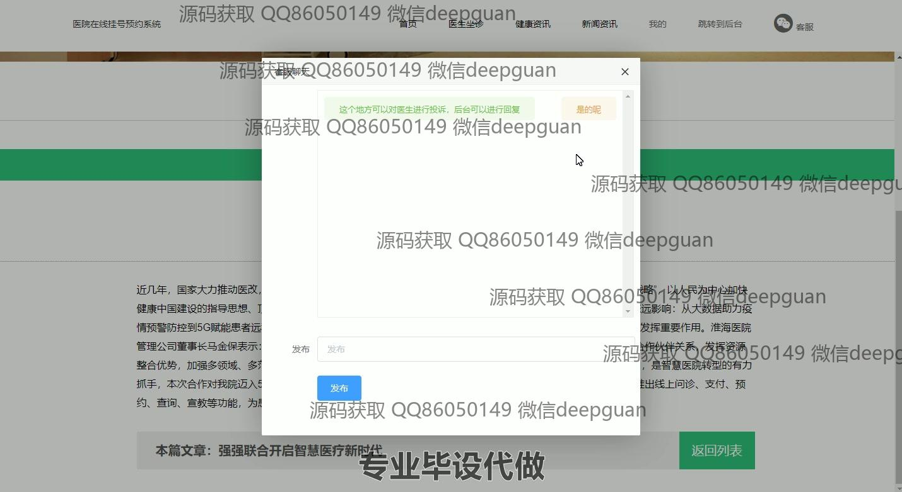
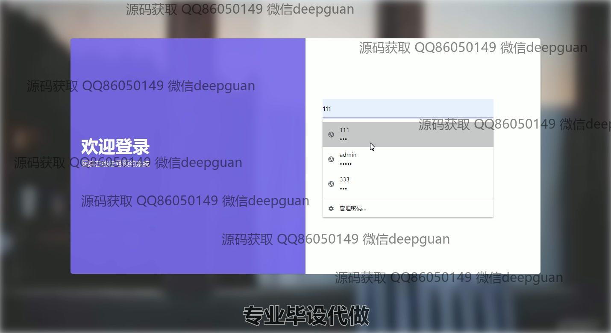

<h1 align="center">基于bs模式的医院在线挂号预约系统</h1>

## 简介
基于BS模式的医院在线挂号预约系统：角色分为管理员、医生、用户；提供在线挂号预约、医生坐诊管理、用户病例管理、健康资讯、在线咨询等功能，提升用户体验和医院管理效率。    --计算机毕业设计源码；毕设源码；java毕业设计源码

## 联系方式

<h3 align="center">获取完整代码与数据库文件 + 微信：deepguan QQ: 86050149 QQ群: 783742310</h3>

<h3 align="center">可帮忙远程部署 包运行成功！提供远程部署、修改代码、设计文档指导、代码讲解等服务！</h3>

## 功能介绍（完整见运行截图）
管理员： 负责系统管理和维护，包括用户管理、科室管理、医生信息管理和预约挂号管理。管理员可以通过导航菜单查看和操作用户列表，管理用户角色和权限，执行添加、修改、查看、删除等操作。能够查看医生的详细信息，以及管理医生坐诊，支持医生信息的查询、添加和删除。管理员还负责管理预约挂号，查看和审核预约信息，并提供病例信息的输入和管理。提供药单、检查项目、结果和注意事项的录入功能，提升系统的高效运行和用户体验。

医生： 医生可以在系统中通过自己的账号登录，查看和管理个人信息和坐诊安排。医生拥有一个专属的个人中心，能够更新自己的专业资料和坐诊时间，帮助患者选择合适的预约时段。页面上提供对医生的详细说明，包括性别、职称、科室、邮箱和擅长领域。医生在个人中心可以管理接受到的预约信息，查阅患者病例，提供诊疗建议，并进行在线咨询和交流，支持更高效地管理自己的从业信息和患者挂号。

用户： 用户可以注册和登录系统，通过简单的页面导航来预约挂号和管理个人医疗记录。用户可选择合适的科室和医生进行预约，系统提供详细的医生信息和挂号价格供参考。用户在个人中心查看和更新个人信息，查询预约记录，根据需要进行预约取消或确认。用户还可以收到健康资讯和医院动态，通过客服聊天窗口与医院沟通反馈问题，并在评论中给予反馈意见，享受便捷的在线医疗服务。

客服： 系统中提供客服功能，帮助用户解决使用过程中遇到的问题。客服界面设计简洁，用户通过聊天窗口可以实时与客服进行交流。客服人员负责收集用户反馈，解答用户关于预约挂号、医生信息、医院就诊等相关问题。系统界面显示客服回复区域，用户输入问题后由客服人员提供解决方案，提升用户的使用体验，并促进用户与医院之间的有效沟通与问题处理。

## 运行截图

本代码来源于网络,仅供学习参考使用!

